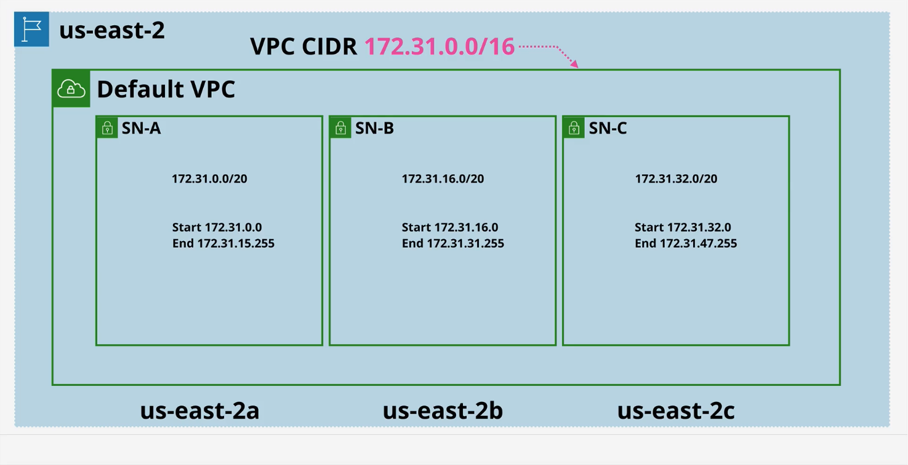
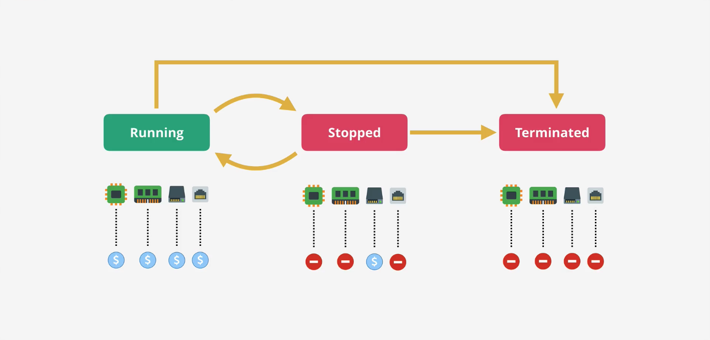
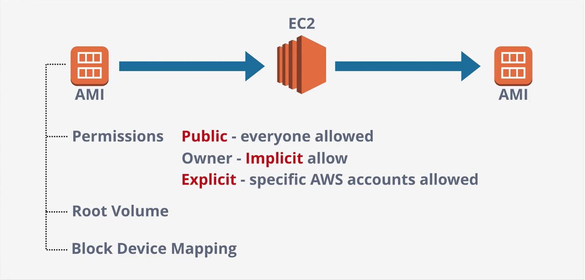
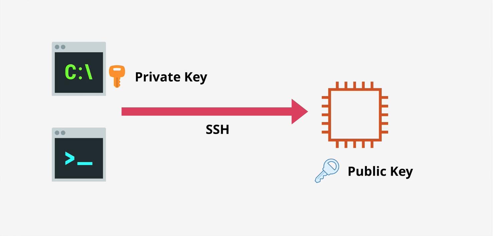

# 1.1 Core Concepts & Infrastructure {.unnumbered}

NOTE: {.column-screen-inset}

# Virtual Private Cloud (VPC) Basics
1. Create private networks within AWS that other private services will run from.
2. Connect AWS private networks to on-prem networks when creating a **hybrid enviornment**.
3. Service to connect to other cloud platforms when creating a **multi-cloud enviornment**.

There is no way for VPC's to communicate out/in. they're *private* and *isolated* unless you decide otherwise.

Type of VPC: 

* Default VPC
    * maximum 1 per region, config. by AWS
* Custom VPC
    * as many per region, config. by you

They are also **regional resilient**. This is how:
They are depolyed in a region and broken down into Subnets. Each SN is inside one of the AV

## Default VPC Facts
* Default VPC CIDR is **always** `172.31.0.0/16`
* `/20` Subnet in each AZ in the region
    * The high the `/number` the smaller the network is
        * For example, two  `/17` networks can fit inside a `/16` network
        * For example, 16 `\20` networks can fit inside a `\16` network
* Provides a Internet Gateway (IGW) to communicate with the internet and vice versa.
* Security Group (SG) and NACL for limiting incoming and outcoming 
* Subnets assign public IPv4 addresses

# Elastic Compute Cloud (EC2) Basic
Provides access to Virtual Machines (VM) known as instances.  

* IAAS (Infrastructure as a Service) 
* Private service by-default - uses VPC networking
    * Launches into a single VPC Subnet
* AZ resilient - Instance fails if AZ fails
    * Because an instance is launched into a specific subnet, and a subnet is in specific AZ
* Different instances sizes and capailities
    * Eg: GPUs, more storgae, TPUs, etc
* Pay-as-you-go billing - per second
* Two popular storage methods:
    1. Local on-host storage
    2. Elastic Block Store (EBS): Network storage for the instance

## Instance Lifecycle
The storage (EBS) is still allocated to the instance regardless if it is running or stopped. See `Stopped` below.

## Amazon Machine Image (AMI) 
An image of an EC2 instance.

An AMI can be used to create a EC2 instance OR an AMI can be created from an EC2 instance.

## Connecting to EC2
You can connect securely to an Amazon EC2 instance using SSH (Secure Shell). it's the way AWS verifies you are you when you try to log in.

This key pair has:
Public key: stored on the EC2 instance.
Private key (.pem file): downloaded and kept only by you. Cannot be recovered later.

