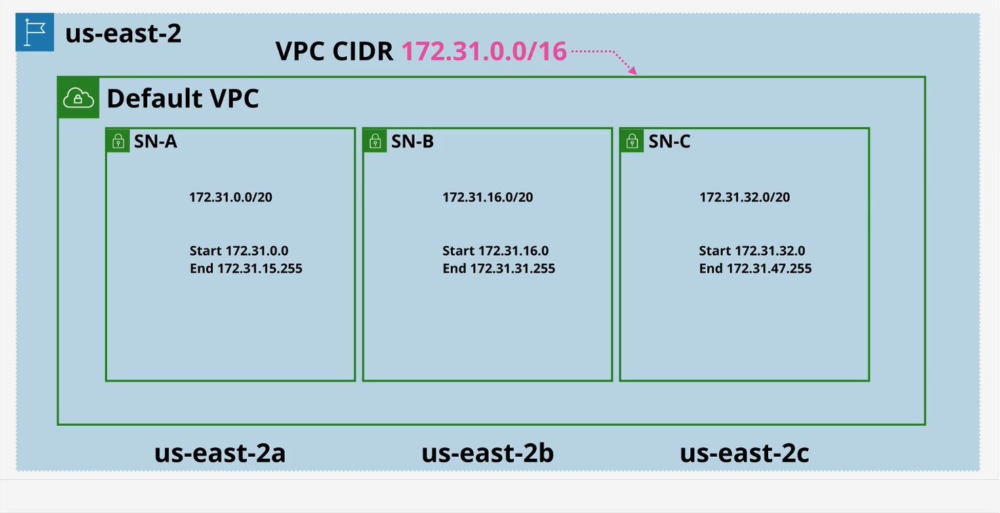
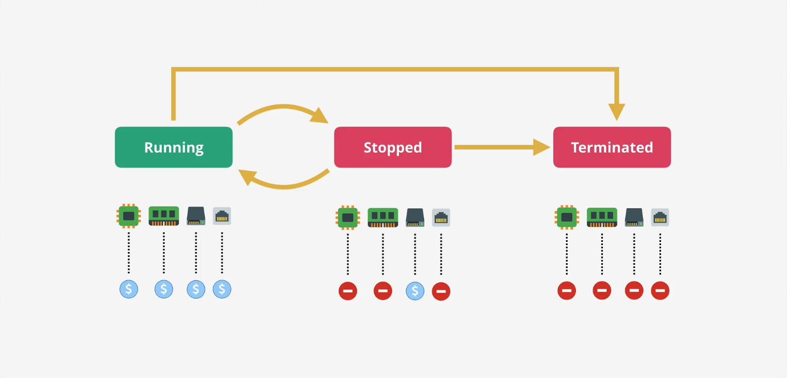
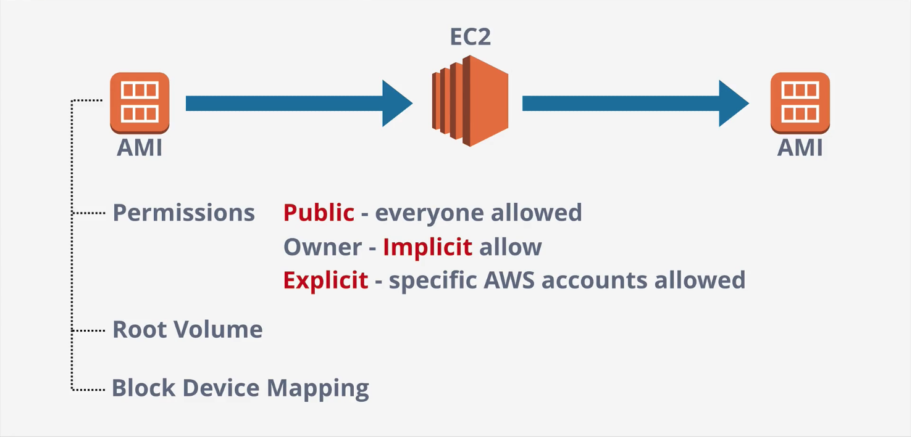
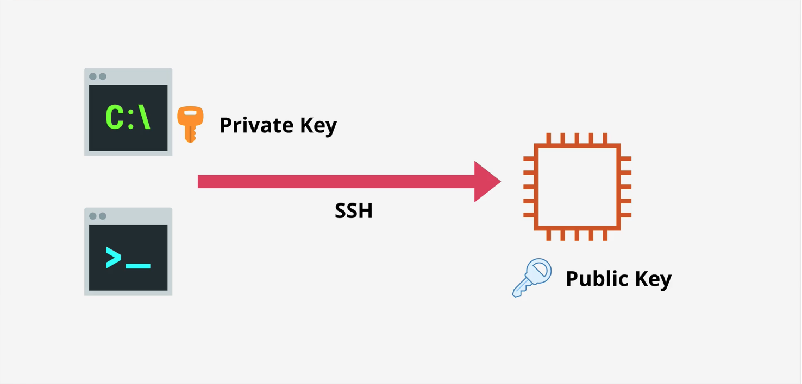
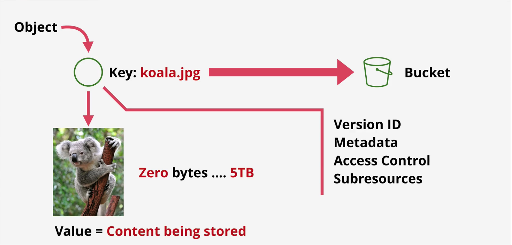
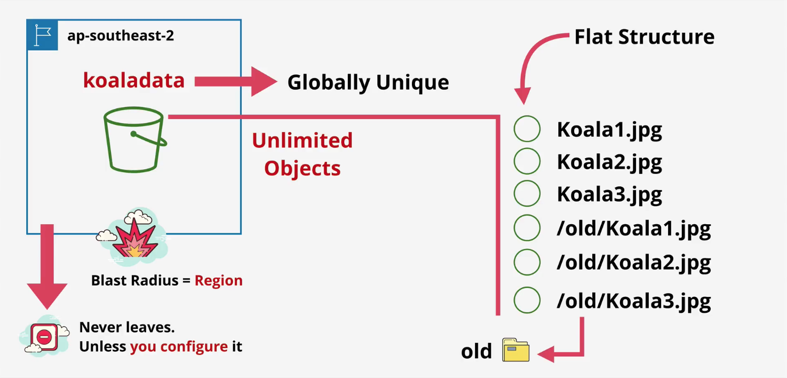
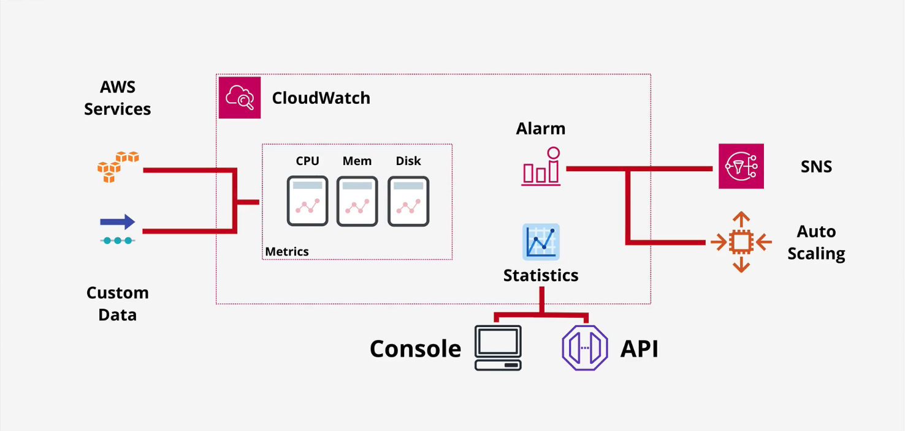
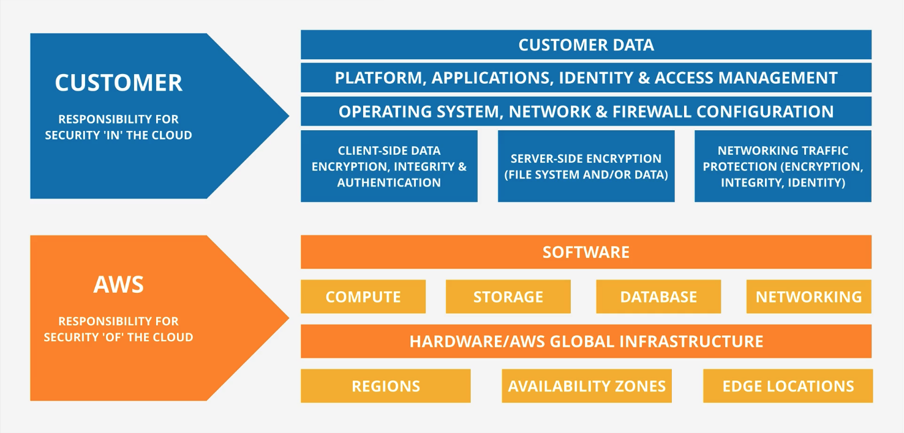

# 1.1 Core Concepts & Infrastructure {.unnumbered}

NOTE: {.column-screen-inset}

# Virtual Private Cloud (VPC) Basics
1. Create private networks within AWS that other private services will run from.
2. Connect AWS private networks to on-prem networks when creating a **hybrid enviornment**.
3. Service to connect to other cloud platforms when creating a **multi-cloud enviornment**.

There is no way for VPC's to communicate out/in. they're *private* and *isolated* unless you decide otherwise.

Type of VPC: 

* Default VPC
    * maximum 1 per region, config. by AWS
* Custom VPC
    * as many per region, config. by you

They are also **regional resilient**. This is how:
They are depolyed in a region and broken down into Subnets. Each SN is inside one of the AV



## Default VPC Facts
* Default VPC CIDR is **always** `172.31.0.0/16`
* `/20` Subnet in each AZ in the region
    * The high the `/number` the smaller the network is
        * For example, two  `/17` networks can fit inside a `/16` network
        * For example, 16 `\20` networks can fit inside a `\16` network
* Provides a Internet Gateway (IGW) to communicate with the internet and vice versa.
* Security Group (SG) and NACL for limiting incoming and outcoming 
* Subnets assign public IPv4 addresses

# Elastic Compute Cloud (EC2) Basics  
Provides access to Virtual Machines (VM) known as instances.  

* IAAS (Infrastructure as a Service) 
* Private service by-default - uses VPC networking
    * Launches into a single VPC Subnet
* AZ resilient - Instance fails if AZ fails
    * Because an instance is launched into a specific subnet, and a subnet is in specific AZ
* Different instances sizes and capailities
    * Eg: GPUs, more storgae, TPUs, etc
* Pay-as-you-go billing - per second
* Two popular storage methods:
    1. Local on-host storage
    2. Elastic Block Store (EBS): Network storage for the instance

## Instance Lifecycle
The storage (EBS) is still allocated to the instance regardless if it is running or stopped. See `Stopped` below. CPU, Memory, Storage, Networking respectivly



## Amazon Machine Image (AMI) 
An image of an EC2 instance.

An AMI can be used to create a EC2 instance OR an AMI can be created from an EC2 instance.

Root Volume: The drive that boots the OS. 
Block Device Mapping: Links the volumns that the AMI has and is presented to the OS. Determins which volumn is the boot volumn and which is the data volumn 



## Connecting to EC2
You can connect securely to an Amazon EC2 instance using SSH (Secure Shell). it's the way AWS verifies you are you when you try to log in.

This key pair has:

Public key: stored on the EC2 instance. <br>
Private key (`.pem` file): downloaded and kept only by you. Cannot be recovered later.




# Simple Storage Service (S3) Basics
- Global Storage Platform (Runs in all the AWS regions)
    - Regional based/resilient 
- Public service, unlimited data & multi-user
    - Can contain Movies, Audio, Photos, Text, Large, ... etc Data sets
- Accessed via GUI/CLI/API/HTTP
- Has S3 consists of **Objects** (similar to files) and **Buckets** (similar to folders)
    - Objects can be from zero bytes to **5TB**

 



- Buckets belong to a region. It never leaves unless configured.
    - It is regional resilient
- Bucket names are **Globally Unique** to AWS
- Buckets can hold **Unlimited Objects
- It a flat structure (not like a folder that can have folders that can folders...)
    - Everything is at the root level
    - However, we could have a "file" like system with prefixes. See image below (old prefix)

::: callout-tip
###### Exam tip 
Most AWS things are often unique in region or AWS account 
:::

## Exam Power Up
- Bucket name are **Globally Unique**
- 3-63 characters, all lower case, no underscores
- Start with a lowercase letter or a number
- Can't be IP formatted e.g. `1.1.1.1`
- Buckets: 100 soft limit, 1000 hard per account (from requests)
    - Note: because of the limit, it would not be wise the make a bucket for each user. We will cover this later
- Unlimited objects in a bucket, 0 bytes to 8 TB
- Key = Name, Value = Data

## S3 Patterns and Anti-Patterns
- S3 is an **object** store - not file or block
- You **can't mount** an S3 bucket as a drive to VM's
- Great for large scale data storage, distrobution or upload
- Great for *offload*ing of instances
- INPUT and/or OUTPUT to many AWS products

# CloudFormation (CFN) Basics
- An Infrastructure as Code (IaC) service for creating, updating and deleting infrasture (EC2, VPCs, IAM, Lambda, S3, etc) in consistent and repeatable templates consistent and repeatable(YAML or JSON) 

A **stack**:
- A stack = all resources created from a template
- Update a stack → CloudFormation handles changes safely
- Delete a stack → CloudFormation deletes all stack resources

## Minimal Read CloudFormation Example (YAML)
```yml
AWSTemplateFormatVersion: "2010-09-09"
Description: Simple S3 bucket example

Resources:
  MyBucket:
    Type: AWS::S3::Bucket
    Properties:
      BucketName: my-example-bucket-12345

Outputs:
  BucketName:
    Value: !Ref MyBucket
    Description: Name of the created S3 bucket

```

# CloudWatch Basics
Collects and mages operations data. Operational data is any data generated by an environment either detailing how it performs, how it nominally runs, or any logging data 
1. **Metrics** - AWS Products, Apps, on-premises systems, even other cloud platforms.
    - Anything running nativly in AWS will handel it's data. 
2. CloudWatch Logs - gpt
3. CloudWatch Events - AWS Services & Schedules



Because CloudWatch watches so many services, we need a way to keep things seperated. 

# Shared Responsibility Model


- Explain the top tmrw

# HA vs FT vs DR
 
## High Availability (HA)
"The system is up almost all the time"

HA focuses on ensuring your application remains accessible even if a component (like a server or zone) fails. It accepts that a failure might cause a very brief "blip" (e.g., a database failover taking 60 seconds), but the system recovers automatically.
- Key Concept: Redundancy and automatic failover.
- Typical AWS Architecture:
    - Running EC2 instances in at least two Availability Zones (AZs) behind a Load Balancer.
- Downtime: Users might experience a timeout or need to refresh the page, but service returns quickly.

## Fault Tolerance (FT)
FT is a step above HA. It guarantees that if a component fails, the system continues processing without **any** interruption or degradation. It requires far more complex and expensive infrastructure because you often need parallel systems processing the same data simultaneously.

- Key Concept: Zero interruption. The user never knows a failure occurred.
- Typical AWS Architecture:
    - Amazon S3: It is designed for 99.999999999% durability. If a drive or rack fails, your data is still instantly available.
- Downtime: Zero.

## Disaster Recovery (DR)
"If the entire Region vanishes, we have a plan."

DR is about preparing for major events—hurricanes, earthquakes, or a total AWS Region outage (e.g., us-east-1 goes dark). It defines how you recover data and operations after the system has completely stopped (When HA and FT Fail).

- Key Concept: Recovery Time Objective (RTO) and Recovery Point Objective (RPO).
- Typical AWS Strategies:
    - Backup & Restore: Storing EBS snapshots or RDS backups in S3 (lowest cost, slowest recovery).
    - Pilot Light: Keeping a tiny database running in a different region (e.g., us-west-2) and turning on the web servers only when disaster strikes.
    - Warm Standby: A scaled-down version of your app running in a second region, ready to scale up.
    - Multi-Region Active/Active: The "Gold Standard" (and most expensive) where traffic is load-balanced between two regions (e.g., Route 53 routing traffic to both N. Virginia and Oregon).

# Route53 Fundamentals
1. Registar Domains
    - Just like GoDaddy, you can purchase and manage domain names (e.g. `my-company.com`) directly through AWS instead of using a thrid party provider to buy the name.
2. Host Zones and Managed Nameservers
    - Host Zones: A "Hosted Zone" is a container for records. This is where you define how traffic should be routed for a domain (e.g., telling the internet that www.example.com points to IP address 1.2.3.4).
    - Managed Nameservers: When you create a hosted zone, AWS assigns four unique "nameservers" to it. AWS manages the infrastructure behind these servers. You don't have to patch, update, or scale the servers that answer DNS queries; AWS does it for you automatically.
3. Global Service
    - Route 53 is not bound to a specific Region (like us-east-1 or eu-west-2).
    - When you configure a DNS record, it is stored in a single logical database that is replicated globally. You do not need to set up Route 53 separately in different regions; one configuration applies to the whole world.
4. Globally Resilient
    - Route 53 is designed to be virtually impossible to take down. It runs on a massive global network of DNS servers

